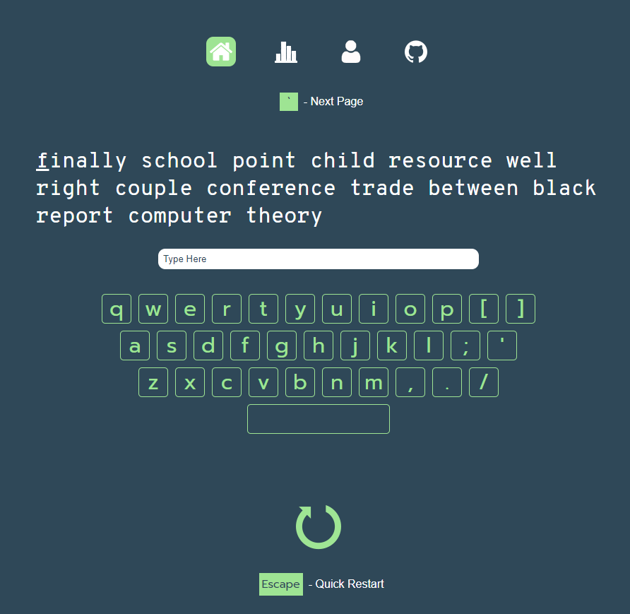

<p align="center">
  <a href="" rel="noopener">
 </a>
</p>

<h3 align="center">Werntype</h3>

---

<p align="center"> A minimalistic typing website </p>
<div align="center">
  
  
  
  
</div>
<br /> <br />

<div align="center">
  <a href="https://werntype.web.app" target="_blank">
    
  </a>
</div>
<br /> <br />

### Running Locally

```
$ git clone https://github.com/braydenwerner/Werntype
$ cd Werntype
$ npm install
$ npm start
```

Create a .env file and connect with your firebase information.

```
REACT_APP_FIREBASE_API_KEY=<YOUR DATA>
REACT_APP_FIREBASE_AUTH_DOMAIN=<YOUR DATA>
REACT_APP_FIREBASE_PROJECT_ID=<YOUR DATA>
REACT_APP_FIREBASE_STORAGE_BUCKET=<YOUR DATA>
REACT_APP_FIREBASE_MESSAGING_SENDER_ID=<YOUR DATA>
REACT_APP_FIREBASE_APP_ID=<YOUR DATA>
REACT_APP_FIREBASE_MEASUREMENT_ID=<YOUR DATA>
```
